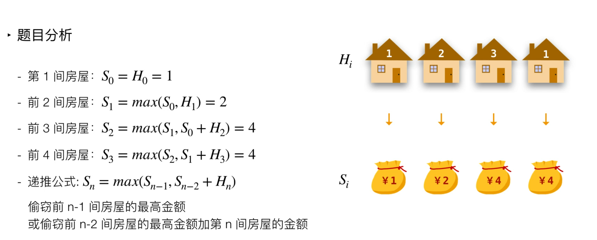

// 思路

```js
var rob = function(nums) {
    let len = nums.length;
    if (len === 0) return 0;
    let dp = [0, nums[0]];
    for (let i = 2; i <= len; i++) {
        dp[i] = Math.max(dp[i - 1], dp[i - 2] + nums[i - 1]);
    }
    return dp[len]
};
```