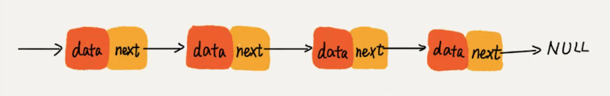

## 什么是链表
1. 多个元素存储的列表
2. 链表中的元素不是顺序存储的，而是通过''next' 指针联系在一起的。

js 中的原型链 原理就是链表结构

## 链表和数组的区别
1. 数组：连续的内存空间，通过索引访问元素，有序存储的，在中间某个位置删除或者添加某个元素，其他元素要跟着动。
2. 链表：通过指针连接在一起的，在中间某个位置删除或者添加元素，不需要移动其他元素。

### 单向链表

### 双向链表
