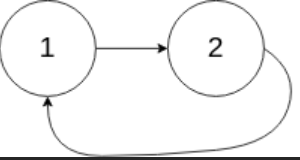

# 什么是链表
1. 多个元素存储的列表
2. 链表中的元素不是顺序存储的，而是通过''next' 指针联系在一起的。

js 中的原型链 原理就是链表结构

# 链表和数组的区别
1. 数组：连续的内存空间，通过索引访问元素，有序存储的，在中间某个位置删除或者添加某个元素，其他元素要跟着动。
2. 链表：通过指针连接在一起的，在中间某个位置删除或者添加元素，不需要移动其他元素。

## 单向链表


## 双向链表


## 循环链表

可以用快慢指针解法，判断链表是否有环

慢指针每个循环周期内遍历一个节点，快指针每个循环周期内遍历两个节点。如果不是循环，那么快指针会先遍历到链表末尾。如果是循环，那么快慢指针会相遇

### 题目：循环链表

给你一个链表的头节点 head ，判断链表中是否有环。

如果链表中有某个节点，可以通过连续跟踪 next 指针再次到达，则链表中存在环。 为了表示给定链表中的环，评测系统内部使用整数 pos 来表示链表尾连接到链表中的位置（索引从 0 开始）。注意：pos 不作为参数进行传递 。仅仅是为了标识链表的实际情况。

如果链表中存在环 ，则返回 true 。 否则，返回 false 。

示例 1：


输入：head = [3,2,0,-4], pos = 1
输出：true
解释：链表中有一个环，其尾部连接到第二个节点。

示例 2：


输入：head = [1,2], pos = 0
输出：true
解释：链表中有一个环，其尾部连接到第一个节点。

示例 3：


输入：head = [1], pos = -1
输出：false
解释：链表中没有环。

### 思路

利用快慢指针，快指针每次走两步，慢指针每次走一步。如果链表有环，那么快慢指针一定会相遇。如果链表无环，那么快指针会先走到末尾。

所以我们可以判断快指针是否为null，如果为空则说明无环。如果不为空，那么就判断快慢指针是否相遇即可

### 代码实现

```js

/**
 * @param {ListNode} head
 * @return {boolean}
 */
var hasCycle = function(head) {
    if(head == null) return false
    let f = head,s = head
    while(f.next != null && f.next.next != null){
        s = s.next
        f = f.next.next
        if( f == s) return true
    }
    return false
};
```

### 题目： 删除链表中的节点
有一个单链表的 head，我们想删除它其中的一个节点 node。

给你一个需要删除的节点 node 。你将 无法访问 第一个节点  head。

链表的所有值都是 唯一的，并且保证给定的节点 node 不是链表中的最后一个节点。


输入：head = [4,5,1,9], node = 5
输出：[4,1,9]
解释：指定链表中值为 5 的第二个节点，那么在调用了你的函数之后，该链表应变为 4 -> 1 -> 9

### 思路

由于无法访问第一个节点，所以我们可以将当前节点的值替换为下一个节点的值，然后删除下一个节点即可。

总结也就是后面的覆盖被删除的节点即可。

```js
// 这是单向链表
{
  val:'a',
  next:{
    val:'b',   // 如果我们要删除b，那么node就是b节点
    next:{
      val:'c',
      next:{
        val:'d',
        next:null
      }
    }
  }
}

// 删除 b 节点 ， 也就是把 node.val = node.next.val, node.next = node.next.next; 把当前节点的值覆盖为下一个节点的值，然后删除下一个节点即可。
{
  val:'a',
  next:{
    val:'c',   // 覆盖b节点的值，然后删除下一个节点即可
    next:{
      val:'d',
      next:null
    }
  }
}
```

### 代码实现

```js
/**
 * Definition for singly-linked list.
 * function ListNode(val) {
 *     this.val = val;
 *     this.next = null;
 * }
 */
/**
 * @param {ListNode} node
 * @return {void} Do not return anything, modify node in-place instead.
 */
var deleteNode = function(node) {
    node.val = node.next.val
    node.next = node.next.next
};
```

### 题目： 删除排序链表中的重复元素

给定一个已排序的链表的头 head ， 删除所有重复的元素，使每个元素只出现一次 。返回 已排序好 的链表 。

示例 1：


输入：head = [1,1,2]
输出：[1,2]

示例 2：


输入：head = [1,1,2,3,3]
输出：[1,2,3]

### 思路

由于是已经排好序的链表，所以我们可以直接遍历一遍即可。

```js
// 这是单向链表
{
  val:'a',
  next:{
    val:'b',   // 如果我们要删除b，那么node就是b节点
    next:{
      val:'c',
      next:{
        val:'d',
        next:null
      }
    }
  }
}

### 代码实现

```js

/**
 * Definition for singly-linked list.
 * function ListNode(val, next) {
 *     this.val = (val===undefined ? 0 : val)
 *     this.next = (next===undefined ? null : next)
 * }
 */
/**
 * @param {ListNode} head
 * @return {ListNode}
 */
var deleteDuplicates = function(head) {
    if(!head) return head
    let cur = head
    while(cur && cur.next){
        if(cur.val == cur.next.val){
            cur.next = cur.next.next
        }else{
            cur = cur.next
        }
    }
    return head
};

```

### 题目: 反转链表

给你单链表的头节点 head ，请你反转链表，并返回反转后的链表。

示例 1：


输入：head = [1,2,3,4,5]
输出：[5,4,3,2,1]

### 思路

我们可以使用迭代的方式来解决这个问题。我们维护三个指针 prev、curr 和 next。其中 curr 是当前遍历到的节点，prev 是其前一个节点，next 是下一个要被处理的节点。

我们先将 curr 的 next 指向 prev，然后将 prev 和 curr 都向前移动一位即可。

```js
// 这是单向链表
{
  val:'a',
  next:{
    val:'b',   // 如果我们要删除b，那么node就是b节点
    next:{
      val:'c',
      next:{
        val:'d',
        next:null
      }
    }
  }
}

### 代码实现

```js
/**
 * Definition for singly-linked list.
 * function ListNode(val, next) {
 *     this.val = (val===undefined ? 0 : val)
 *     this.next = (next===undefined ? null : next)
 * }
 */
/**
 * @param {ListNode} head
 * @return {ListNode}
 */
var reverseList = function(head) {
    let prev = null
    let curr = head
    while(curr){
        const next = curr.next
        curr.next = prev
        prev = curr
        curr = next
    }
    return prev
};
```